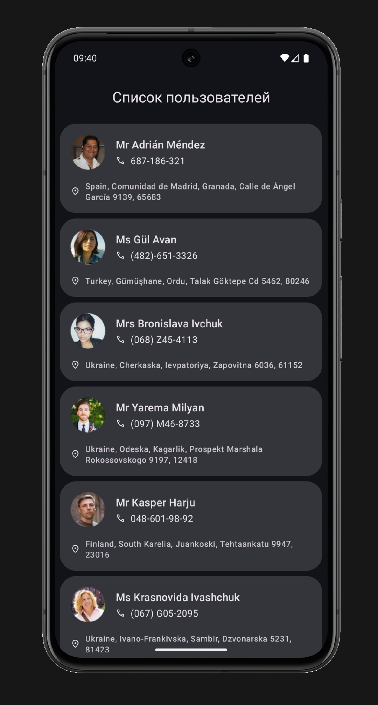
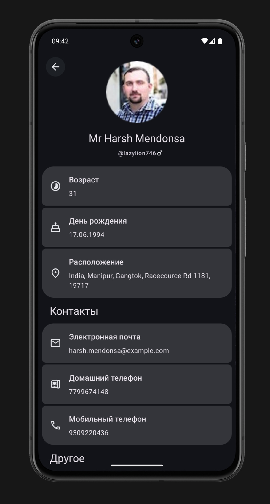

# ShiftTestTask [Apk (G.Drive)](https://drive.google.com/drive/folders/1AGlULsIdCoyhO91usBXYUpBmD2qI6cX9?hl=ru)
Тестовое задание. Приложение для отображения списка случайных пользователей от API https://randomuser.me/.
## Скриншоты

  
  

## Основная информация
Приложениие разработанно на Android Studio Meerkat | 2024.3.1 Patch 1, built on March 13, 2025.
- Язык: Kotlin;
- MinSdk: 30;
- Архитектура: Clean architecture;
- Сеть: Retrofit + OkHttp как стандарт работы с сетью в Android;
- ORM: Room database была выбрана из-за удобной интеграции с Flow;
- Di: Hilt был выбран из-за удобной интеграции с коммпоненатми Android и проверки циклических зависимостей на этапе компиляции;
- Асинхронность: Coroutines + flow были выбраны как нативный для Kotlin и самый удобный подход к выполнению асинхронных операций;
- Ui: XML View + ViewBinding;
- Image download/cache: Picasso была выбранна как простая и достаточная для данного проекта библиотека;
- Навигация: NavComponent + SafeArgs были использованны для упрощения навигации и передаче данных между фрагментами приложения.

В приложении имеются два Gradle модуля App и Data. Domain модуль было принято решение не реализовывать из-за маленького размера приложения и наличия всего одного репозитория. В модуле бизнес логики имеются два источника данных Local и Remote, где Local является SSOT. Репозиторий же предоставляет данные для Ui в видe Flow. Хоть получение списка пользователей и происходит с помощью Flow, для отображения подробной ифнормации об конкретном пользователе используется обычная suspend функция, поскольку Api не имеет возможности предоставлять изменения конкретного пользователя и такого подхода было достаточно. Для экономии времени сохранение в базу данных происходит в виде сериализации Network модели и сохранении ее как json.

В Ui слое используется стандратный подход с XML View + ViewBinding с Fragments и ViewModel, которые предоставляют полученные от репозитория данные для Ui в виде State/Shared Flow с классами данных uiState. В Ui слое дополнительно была реализованна анимация между фрагментами, темная и светлая тема, локализация, хоть и без настроек внутри приложения. Спискок пользователей реализованн с помщью RecyclerView с DiffUtil, который можно обновить с помщью SwipeToRefresh. В приложении реализованны неявные Intent для работы с email, адрессом и номером телефона. Добавлена обработка ошибок.
